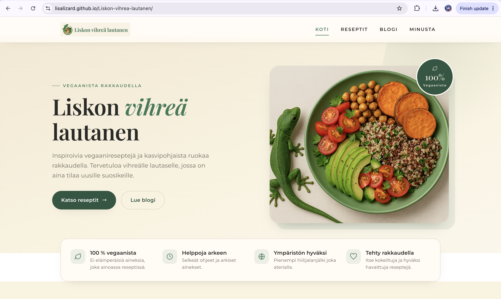
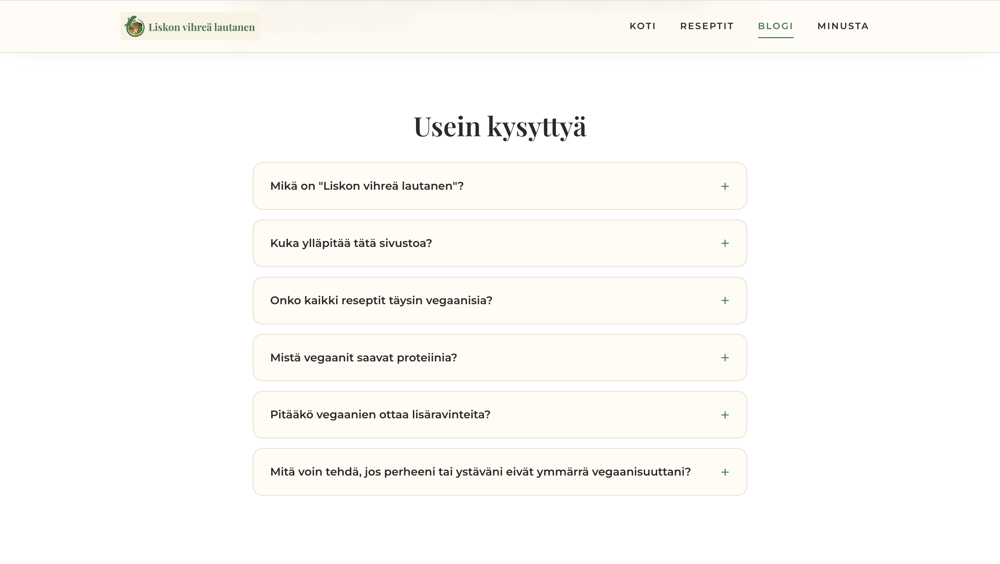

# 🦎 Liskon vihreä lautanen — Vegan Recipe Website

A responsive, multi-page website for plant-based recipes, a veganism & sustainability blog, and a personal story — designed and built from scratch with hand-written HTML, CSS, and JavaScript.


**🔗 Live site:** https://lisalizard.github.io/Liskon-vihrea-lautanen/


## About the project

*Liskon vihreä lautanen* ("Lisko's green plate") is a Finnish-language vegan food website. It brings together easy plant-based recipes, short articles on veganism and its environmental impact, and the story behind the blog.

I designed and built the site **from scratch** as a coursework project during my BBA in Data Analytics at **Haaga-Helia University of Applied Sciences**. The goal was to practice front-end fundamentals — semantic markup, responsive layout, and a consistent visual identity — while shipping a real, deployed product. **The project was awarded the highest grade (5/5).**


## Features

- **Fully responsive**, mobile-first layout that adapts from phone to desktop
- **Multi-page architecture** — Home, Recipes, Blog, and About
- **Reusable design system** built with CSS custom properties (color, spacing, and typography tokens) in a single shared stylesheet
- **Recipe pages** with ingredient lists and numbered, step-by-step instructions
- **Blog** with articles and an interactive **FAQ accordion** using the native `<details>` element
- **Sticky navigation** with a scroll state and an accessible **mobile menu** (vanilla JavaScript)
- **Custom typography pairing** — Playfair Display for headings, Montserrat for body text
- **SEO meta tags** and semantic HTML on every page
- **No frameworks** — everything is hand-written HTML, CSS, and JS


## Tech stack

| Area        | Tools                                                  |
|-------------|--------------------------------------------------------|
| Markup      | HTML5 (semantic)                                       |
| Styling     | CSS3 — Flexbox, Grid, custom properties, media queries |
| Interaction | Vanilla JavaScript                                     |
| Typography  | Google Fonts (Playfair Display, Montserrat)            |
| Hosting     | GitHub Pages                                           |


## Project structure

```
Liskon-vihrea-lautanen-1/
├── index.html        # Home
├── reseptit.html     # Recipes
├── blogi.html        # Blog + FAQ
├── minusta.html      # About
├── tyyli.css         # Shared stylesheet (design system)
└── Kuvat/            # Images
    ├── logo.png
    ├── Kotisivu_kuvat/
    ├── Reseptitsivu_kuvat/
    ├── Blogisivu_kuvat/
    └── Yhteistiedotsivu_kuvat/
```

## Design system

A small set of tokens keeps the look consistent across all pages.

| Token        | Value     | Use                             |
|--------------|-----------|---------------------------------|
| Green        | `#3B7A57` | Primary accent, links, headings |
| Deep green   | `#2C5641` | Buttons, banner, footer         |
| Cream        | `#FAF3E0` | Section backgrounds             |
| Warm white   | `#FFFBF4` | Cards                           |
| Ink          | `#2A2A28` | Body text                       |

**Typography:** Playfair Display (display / headings) · Montserrat (body / UI)


## Screenshots

### Home page


### FAQ


## Author

**Lisa Maevskaia** — BBA Data Analytics student, Haaga-Helia University of Applied Sciences

- GitHub: [@lisalizard](https://github.com/lisalizard)
- Email: lisa.maevskaia@gmail.com
- LinkedIn: www.linkedin.com/in/elizaveta-maevskaia-7883b0296


*Recipes, texts, and images are my own work, created for this project.*
